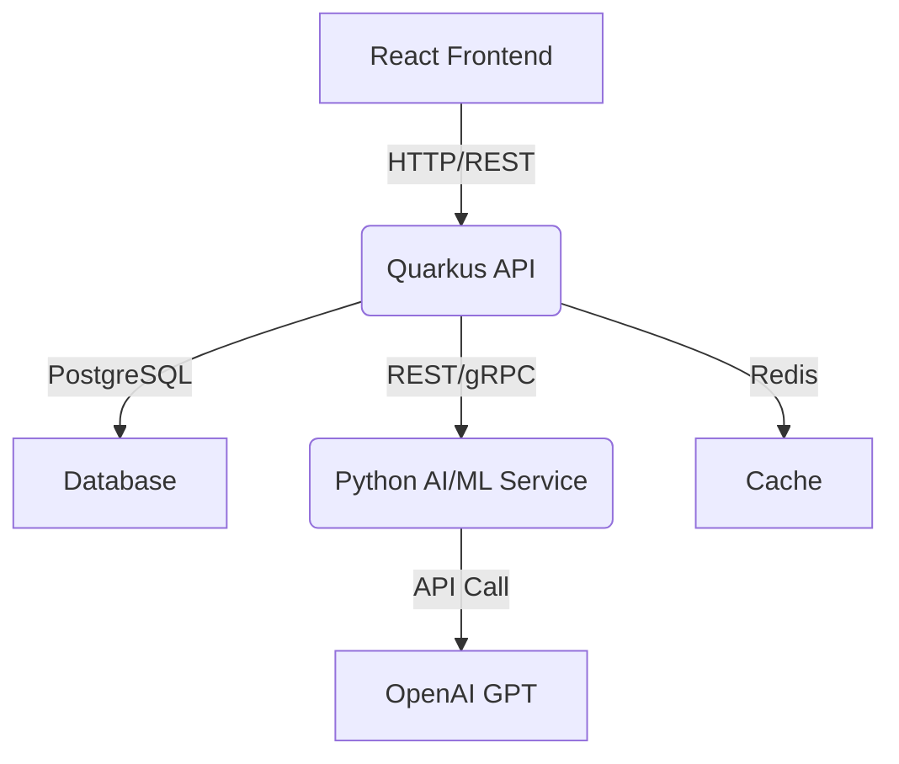
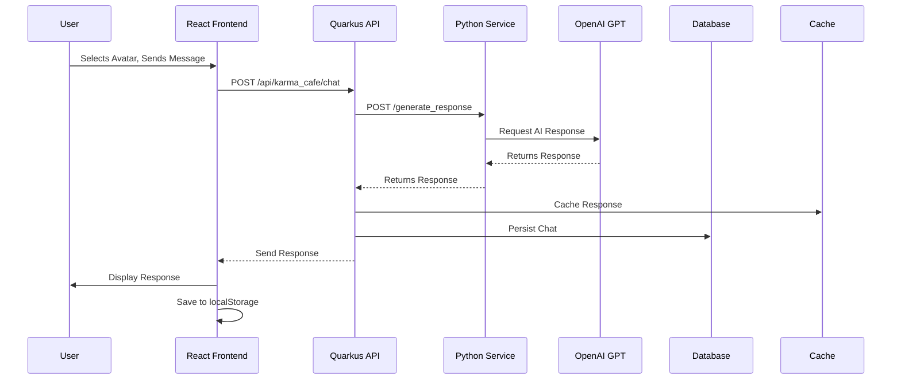
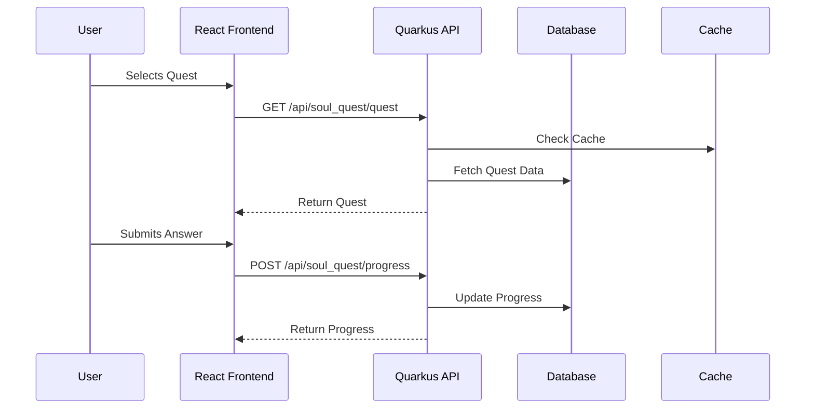
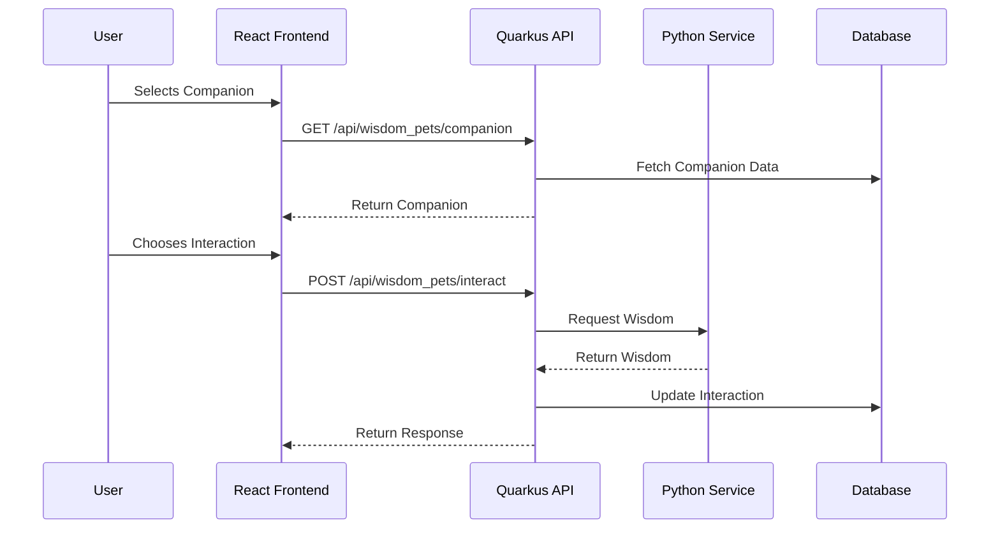

# Nandi Platform - README

## Project Overview

The Nandi platform is a spiritual wellness application integrating Vedic wisdom through interactive modules: **KarmaCafe** (AI chat), **SoulQuest** (spiritual quests), and **WisdomPets** (virtual companions). This README details the updated architecture using **Quarkus** for the API layer, **React** for the frontend, and **Python** for AI/ML services, leveraging your Java expertise.

## Architecture

### Technology Stack
- **Frontend:** React (with React Router, Axios)
- **API Layer:** Quarkus (Java-based, REST/gRPC, Hibernate ORM)
- **AI/ML Service:** Python (FastAPI, OpenAI GPT, Celery)
- **Database:** PostgreSQL (persistence), Redis (caching)
- **Deployment:** Docker, Kubernetes

### High-Level Architecture


- **React Frontend:** Handles UI/UX (e.g., KarmaCafe chat interface, SoulQuest navigation).
- **Quarkus API:** Manages business logic, API endpoints, and database interactions.
- **Python AI/ML Service:** Processes AI tasks (e.g., chat responses for KarmaCafe).
- **PostgreSQL:** Stores user data, quest progress, pet states.
- **Redis:** Caches frequent data (e.g., chat history).

---

## Detailed Component Breakdown

### 1. React Frontend
- **Purpose:** Delivers an interactive, responsive UI for all modules.
- **Features:**
  - KarmaCafe: Chat interface with persona selection (Karma, Dharma, Atma).
  - SoulQuest: Quest selection and question navigation.
  - WisdomPets: Companion interaction and care system.
- **Implementation:**
  - Uses React Router for navigation (e.g., `/karma`, `/soul`).
  - State managed with `useState`, localStorage for persistence.
  - Styled with CSS modules (e.g., `KarmaCafe.css`).
- **Interaction:** Sends HTTP requests to Quarkus API via Axios.

**Diagram:**
```
[React Frontend]
   ├── KarmaCafe.js (Persona Bar, Navigation)
   ├── KarmaChat.js (Chat Area, Input)
   ├── SoulQuest.js (Quest Selection)
   ├── WisdomPets.js (Companion Interface)
   └── Axios --> Quarkus API
```

### 2. Quarkus API
- **Purpose:** Orchestrates requests, handles business logic, and interacts with services.
- **Features:**
  - REST endpoints (e.g., `/api/karma_cafe/chat`, `/api/soul_quest/quest`).
  - Authentication (future JWT/OAuth2 support).
  - Database access via Hibernate ORM.
  - Routes AI requests to Python service.
- **Implementation:**
  - Java-based with Quarkus framework.
  - Native compilation with GraalVM for performance.
  - Integrated with PostgreSQL and Redis.
- **Interaction:**
  - Receives requests from React frontend.
  - Forwards AI tasks to Python service (REST/gRPC).
  - Persists data in PostgreSQL, caches in Redis.

### 3. Python AI/ML Service
- **Purpose:** Handles AI/ML tasks, especially for KarmaCafe’s chat functionality.
- **Features:**
  - Integrates with OpenAI GPT for chat responses.
  - Supports future NLP tasks (e.g., sentiment analysis).
  - Async processing with Celery for background tasks.
- **Implementation:**
  - Uses FastAPI for a lightweight API.
  - Leverages Python’s AI/ML libraries (e.g., Hugging Face).
  - Deployed as a separate microservice.
- **Interaction:**
  - Receives requests from Quarkus API.
  - Calls OpenAI GPT API for AI generation.
  - Returns responses to Quarkus.

---

## Interactions Between Components

### 1. User Initiates Chat (KarmaCafe)


### 2. User Starts Quest (SoulQuest)


### 3. User Interacts with Pet (WisdomPets)


---

## Setup and Development

### Prerequisites
- Java 17+
- Node.js 18+
- Python 3.9+
- Docker
- Kubernetes (optional)

### Installation
1. Clone Repository:
   ```bash
   git clone https://github.com/your-repo/nandi.git
   cd nandi
   ```
2. Install dependencies and run services (React, Quarkus, Python).

### Deployment
- Dockerize each service.
- Deploy on Kubernetes.
- Set up CI/CD.

---

## Future Improvements
- Add JWT authentication.
- Implement Redux for state management.
- Use gRPC for Quarkus ↔ Python communication.
- Deploy on AWS EKS.

## Conclusion
This Quarkus-React-Python architecture ensures scalability and supports Nandi’s AI-driven features.

