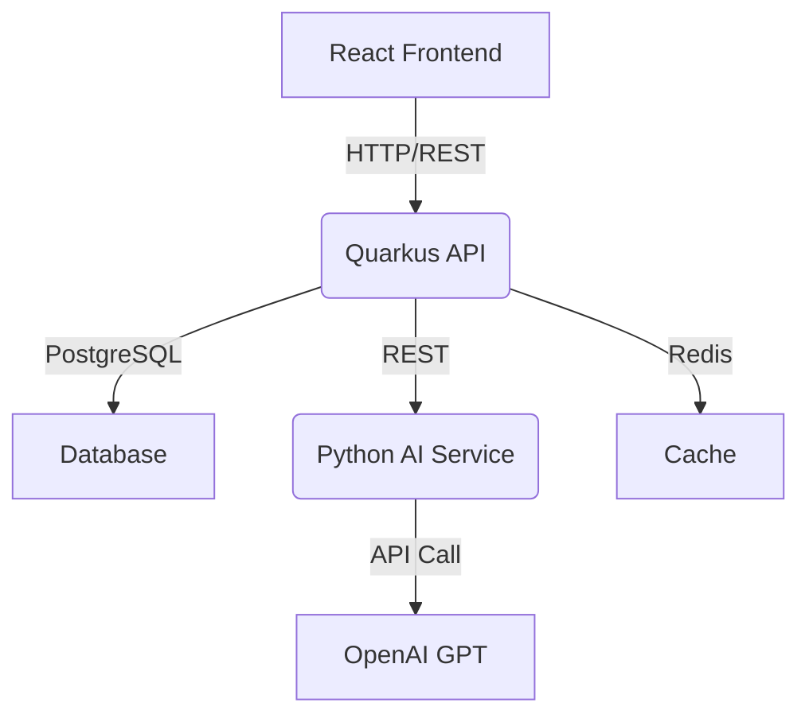

# KarmaCafe Chat Implementation Plan

## Overview

The KarmaCafe chat feature enables users to interact with AI personas (Karma/Lumina, Dharma/Nova, Atma/Solis) for spiritual guidance and mindfulness coaching. This document outlines the technical implementation plan from frontend to backend, detailing the data flow, API contracts, and system interactions.

## Architecture Components



### Component Responsibilities

1. **React Frontend**
   - Renders chat bubbles (ChatBubbles.js)
   - Manages chat window UI (NandiChatWindow.js)
   - Handles message state and UI interactions (Chat.js)

2. **Quarkus API**
   - Manages chat sessions
   - Routes messages to AI service
   - Persists chat history
   - Handles user authentication

3. **Python AI Service** 
   - Processes chat messages
   - Formats prompts based on selected persona
   - Calls OpenAI GPT API
   - Returns responses to API layer

4. **Database (PostgreSQL)**
   - Stores chat history
   - Persists user preferences
   - Tracks interaction metrics

5. **Cache (Redis)**
   - Caches recent chat history
   - Stores session data
   - Improves response time

## Detailed Implementation Flow

### 1. User Initiates Chat

#### Frontend Implementation (React)

##### Chat Bubbles Component
```javascript
// nandi-frontend/src/components/Chat/ChatBubbles.js
// Displays the floating chat bubbles for different personas
const ChatBubbles = ({ activeChat, onChatToggle }) => {
  // Chat themes with icons and visual styling
  const chatThemes = [
    {
      id: 'karma',
      name: 'Lumina ⚡',
      color: '#FF9800',
      position: 'bottom',
      icon: FaBalanceScale
    },
    // Other personas...
  ];
  
  return (
    <div className="side-chat-icons">
      {chatThemes.map((theme) => (
        <button
          key={theme.id}
          className={`chat-icon-button ${theme.id} ${activeChat === theme.id ? 'active' : ''}`}
          onClick={() => onChatToggle(theme.id)}
          aria-label={`${activeChat === theme.id ? 'Close' : 'Open'} ${theme.name}`}
          title={theme.name}
        >
          <div className="chat-icon">
            <IconComponent />
          </div>
        </button>
      ))}
    </div>
  );
};
```

##### Main Chat Component
```javascript
// nandi-frontend/src/components/Chat/Chat.js
// Controls chat state and orchestrates the chat feature
const Chat = () => {
  const [activeChat, setActiveChat] = useState(null);
  const [messageHistories, setMessageHistories] = useState({});
  
  // Handle chat toggle
  const handleChatToggle = (chatId) => {
    setActiveChat(chatId === activeChat ? null : chatId);
    // Additional UI adjustments...
  };
  
  // Handle messages update
  const handleMessagesUpdate = (messages) => {
    setMessageHistories(prev => ({
      ...prev,
      [activeChat]: messages
    }));
  };
  
  return (
    <div className="chat-demo">
      <ChatBubbles 
        activeChat={activeChat}
        onChatToggle={handleChatToggle}
      />
      
      {activeChat && (
        <NandiChatWindow
          theme={getActiveChatTheme()}
          onClose={handleCloseChat}
          messages={messageHistories[activeChat] || []}
          onMessagesUpdate={handleMessagesUpdate}
        />
      )}
    </div>
  );
};
```

##### Chat Window Component
```javascript
// nandi-frontend/src/components/Chat/NandiChatWindow.js
// Renders the chat window with messages and input
const NandiChatWindow = ({ theme, onClose, messages, onMessagesUpdate }) => {
  const [inputMessage, setInputMessage] = useState('');
  
  const handleSendMessage = (e) => {
    e.preventDefault();
    
    if (!inputMessage.trim()) return;
    
    // Add user message to UI immediately
    const newUserMessage = {
      id: Date.now(),
      message: inputMessage,
      sentTime: new Date().toISOString(),
      sender: 'user',
      direction: 'outgoing'
    };
    
    const updatedMessages = [...messages, newUserMessage];
    onMessagesUpdate(updatedMessages);
    
    // Clear input
    setInputMessage('');
    
    // Call API to get AI response
    fetchAIResponse(inputMessage, theme.id, updatedMessages);
  };
  
  const fetchAIResponse = async (message, persona, messageHistory) => {
    // Display typing indicator
    setIsTyping(true);
    
    try {
      // Call backend API
      const response = await fetch('/api/karma_cafe/chat', {
        method: 'POST',
        headers: {
          'Content-Type': 'application/json',
        },
        body: JSON.stringify({
          message,
          persona,
          context: messageHistory.map(msg => ({
            content: msg.message,
            role: msg.sender === 'user' ? 'user' : 'assistant'
          }))
        }),
      });
      
      const data = await response.json();
      
      // Add AI response to chat
      const aiResponse = {
        id: Date.now() + 1,
        message: data.message,
        sentTime: new Date().toISOString(),
        sender: 'system',
        direction: 'incoming'
      };
      
      onMessagesUpdate([...messageHistory, aiResponse]);
    } catch (error) {
      console.error('Error fetching AI response:', error);
      // Handle error (show error message)
    } finally {
      setIsTyping(false);
    }
  };
  
  return (
    <div className="nandi-chat-window">
      {/* Messages display */}
      <div className="chat-messages-container">
        {messages.map(msg => (/* Message rendering */)}
        {isTyping && (/* Typing indicator */)}
      </div>
      
      {/* Input form */}
      <form className="chat-input-area" onSubmit={handleSendMessage}>
        <input
          type="text"
          className="chat-input"
          placeholder={getPlaceholderForTheme(theme?.id)}
          value={inputMessage}
          onChange={(e) => setInputMessage(e.target.value)}
        />
        <div className="chat-buttons-container">
          <button type="submit" className="chat-send-button">
            {/* Send icon */}
          </button>
          <button type="button" className="chat-close-button" onClick={onClose}>
            ✕
          </button>
        </div>
      </form>
    </div>
  );
};
```

#### Backend Implementation

##### Quarkus API (Java)

###### API Controller
```java
// nandi-api/src/main/java/com/nandi/api/controller/ChatController.java
@Path("/api/karma_cafe")
@Produces(MediaType.APPLICATION_JSON)
@Consumes(MediaType.APPLICATION_JSON)
public class ChatController {
    
    @Inject
    ChatService chatService;
    
    @Inject
    SecurityService securityService;
    
    @POST
    @Path("/chat")
    public Response processChatMessage(ChatRequest request) {
        // 1. Authenticate user (if required)
        User currentUser = securityService.getCurrentUser();
        
        // 2. Process chat request
        ChatResponse response = chatService.processMessage(
            request.getMessage(),
            request.getPersona(),
            request.getContext(),
            currentUser
        );
        
        // 3. Return response
        return Response.ok(response).build();
    }
}
```

###### Service Layer
```java
// nandi-api/src/main/java/com/nandi/api/service/ChatService.java
@ApplicationScoped
public class ChatService {
    
    @Inject
    AIServiceClient aiServiceClient;
    
    @Inject
    ChatRepository chatRepository;
    
    @Inject
    CacheManager cacheManager;
    
    public ChatResponse processMessage(String message, Persona persona, List<MessageContext> context, User user) {
        // 1. Check cache for similar queries (optional optimization)
        Optional<String> cachedResponse = cacheManager.getChatResponse(message, persona);
        if (cachedResponse.isPresent()) {
            // Log cache hit and return cached response
            return new ChatResponse(cachedResponse.get());
        }
        
        // 2. Call AI service for response
        String aiResponse = aiServiceClient.generateResponse(message, persona, context);
        
        // 3. Persist chat messages
        persistChatMessages(message, aiResponse, persona, user);
        
        // 4. Cache response for future similar queries
        cacheManager.cacheResponse(message, aiResponse, persona);
        
        // 5. Return response
        return new ChatResponse(aiResponse);
    }
    
    private void persistChatMessages(String userMessage, String aiResponse, Persona persona, User user) {
        // Create and save user message
        ChatMessage userChatMessage = new ChatMessage(
            MessageType.USER,
            userMessage,
            persona,
            user
        );
        chatRepository.persist(userChatMessage);
        
        // Create and save AI response
        ChatMessage aiChatMessage = new ChatMessage(
            MessageType.AI,
            aiResponse,
            persona,
            user
        );
        chatRepository.persist(aiChatMessage);
    }
}
```

###### AI Service Client
```java
// nandi-api/src/main/java/com/nandi/api/client/AIServiceClient.java
@ApplicationScoped
public class AIServiceClient {
    
    @ConfigProperty(name = "ai.service.url")
    String aiServiceUrl;
    
    @Inject
    RestClient restClient;
    
    public String generateResponse(String message, Persona persona, List<MessageContext> context) {
        // Build request to AI service
        AIRequest request = new AIRequest();
        request.setMessage(message);
        request.setPersona(persona.toString().toLowerCase());
        request.setContext(context);
        
        // Call AI service
        try {
            AIResponse response = restClient.post(
                aiServiceUrl + "/generate",
                request,
                AIResponse.class
            );
            return response.getMessage();
        } catch (Exception e) {
            // Log error and return fallback message
            Logger.error("Error calling AI service", e);
            return getFallbackResponse(persona);
        }
    }
    
    private String getFallbackResponse(Persona persona) {
        // Return appropriate fallback message based on persona
        switch (persona) {
            case KARMA:
                return "I'm reflecting on your message about choices and actions. Could you share more?";
            case DHARMA:
                return "I'm contemplating your journey and purpose. Would you like to explore further?";
            case ATMA:
                return "Let's take a moment to breathe and center ourselves. What feelings arise?";
            default:
                return "I'm here to assist you on your spiritual journey. How can I help?";
        }
    }
}
```

##### Python AI Service

###### API Endpoint
```python
# nandi-ai-service/app/api/routes/chat.py
@router.post("/generate", response_model=ChatResponse)
async def generate_chat_response(
    request: ChatRequest,
    openai_service: OpenAIService = Depends(get_openai_service)
):
    try:
        response = await openai_service.generate_response(
            message=request.message,
            persona=request.persona,
            context=request.context
        )
        return ChatResponse(message=response)
    except Exception as e:
        raise HTTPException(
            status_code=500,
            detail=f"Error generating response: {str(e)}"
        )
```

###### OpenAI Service
```python
# nandi-ai-service/app/services/openai_service.py
class OpenAIService:
    def __init__(self):
        self.settings = Settings()
        openai.api_key = self.settings.OPENAI_API_KEY
        self.model = self.settings.DEFAULT_MODEL
    
    @retry(stop=stop_after_attempt(3), wait=wait_exponential(multiplier=1, min=2, max=10))
    async def generate_response(self, message: str, persona: str, context: Optional[List[Dict[str, Any]]] = None) -> str:
        """Generate a chat response using OpenAI API."""
        
        # Create system message based on persona
        system_message = self._get_persona_prompt(persona)
        
        # Create messages array
        messages = [{"role": "system", "content": system_message}]
        
        # Add context if provided
        if context:
            messages.extend(context)
        
        # Add user message
        messages.append({"role": "user", "content": message})
        
        # Call OpenAI API
        response = await openai.ChatCompletion.acreate(
            model=self.model,
            messages=messages,
            max_tokens=500,
            temperature=0.7,
        )
        
        # Extract and return response text
        return response.choices[0].message.content
    
    def _get_persona_prompt(self, persona: str) -> str:
        """Get system prompt based on selected persona."""
        
        prompts = {
            "karma": """
            You are Karma, a wise and compassionate AI guide in the Nandi spiritual wellness platform.
            You focus on the principle of cause and effect in spiritual life.
            Respond to the user's questions with wisdom about actions and their consequences.
            Incorporate Vedic principles related to karma yoga and righteous action.
            Be concise, warm, and insightful in your responses.
            """,
            
            "dharma": """
            You are Dharma, a principled and scholarly AI guide in the Nandi spiritual wellness platform.
            You focus on duty, virtue, and the right way of living according to one's nature.
            Respond to the user's questions with wisdom about righteous duties and ethical dilemmas.
            Incorporate Vedic principles related to dharma and one's purpose in life.
            Be thoughtful, structured, and clear in your responses.
            """,
            
            "atma": """
            You are Atma, a deeply meditative and mystical AI guide in the Nandi spiritual wellness platform.
            You focus on the nature of the self, consciousness, and spiritual awakening.
            Respond to the user's questions with wisdom about self-realization and inner peace.
            Incorporate Vedic principles related to the nature of consciousness and meditation.
            Be profound, contemplative, and illuminating in your responses.
            """
        }
        
        return prompts.get(persona.lower(), prompts["karma"])
```

## API Contracts

### Chat Request (Frontend to Quarkus API)

```json
{
  "message": "How can I find my purpose in life?",
  "persona": "dharma",
  "context": [
    {
      "role": "user",
      "content": "Hello, I'm feeling lost"
    },
    {
      "role": "assistant",
      "content": "I understand that feeling. Would you like to explore what might be causing this?"
    }
  ]
}
```

### Chat Response (Quarkus API to Frontend)

```json
{
  "message": "Finding your purpose begins with understanding your unique gifts and values. Consider what activities bring you joy and fulfillment. In the Vedic tradition, dharma is about aligning your actions with your authentic self. Start by reflecting on these questions: What activities make you lose track of time? What contributions do you feel called to make? Small steps of exploration will gradually reveal your path.",
  "id": "chat-response-123456",
  "timestamp": "2023-07-10T15:30:45Z"
}
```

### AI Request (Quarkus API to AI Service)

```json
{
  "message": "How can I find my purpose in life?",
  "persona": "dharma",
  "context": [
    {
      "role": "user",
      "content": "Hello, I'm feeling lost"
    },
    {
      "role": "assistant",
      "content": "I understand that feeling. Would you like to explore what might be causing this?"
    }
  ]
}
```

### AI Response (AI Service to Quarkus API)

```json
{
  "message": "Finding your purpose begins with understanding your unique gifts and values. Consider what activities bring you joy and fulfillment. In the Vedic tradition, dharma is about aligning your actions with your authentic self. Start by reflecting on these questions: What activities make you lose track of time? What contributions do you feel called to make? Small steps of exploration will gradually reveal your path."
}
```

## Database Schema

### ChatMessage Table

| Column     | Type           | Description                                 |
|------------|----------------|---------------------------------------------|
| id         | Long           | Primary key                                 |
| type       | MessageType    | Enum: USER or AI                            |
| content    | String         | Message content (max 2000 chars)            |
| persona    | Persona        | Enum: KARMA, DHARMA, or ATMA                |
| user_id    | Long           | Foreign key to User table                   |
| created_at | LocalDateTime  | Timestamp when message was created          |

## Caching Strategy

### Redis Cache Structure

- Key: `chat:{persona}:{message_hash}`
- Value: AI response
- TTL: 1 week (configurable)

## Error Handling

1. **Frontend Errors**
   - Network errors: Retry with exponential backoff
   - API errors: Display user-friendly message
   - Session expiration: Redirect to login

2. **Quarkus API Errors**
   - Validation errors: Return 400 Bad Request
   - Authentication errors: Return 401 Unauthorized
   - AI service errors: Use fallback responses
   - Database errors: Log and return graceful error

3. **AI Service Errors**
   - OpenAI API failures: Retry with exponential backoff
   - Content policy violations: Filter and return appropriate message
   - Timeout errors: Return status code for frontend retry

## Implementation Timeline

1. **Phase 1: Basic Functionality** (1-2 weeks)
   - Implement chat UI components
   - Create chat API endpoints
   - Set up basic AI service integration
   - Implement message persistence

2. **Phase 2: Enhanced Functionality** (2-3 weeks)
   - Add context management for multi-turn conversations
   - Implement caching for frequently asked questions
   - Add analytics tracking
   - Improve error handling and fallbacks

3. **Phase 3: Optimization** (1-2 weeks)
   - Performance optimization
   - UX improvements based on user feedback
   - Add additional persona customization
   - Implement chat history browsing

## Security Considerations

1. **Authentication**
   - JWT-based authentication for API requests
   - Session management for chat history

2. **Data Protection**
   - Encryption for sensitive data
   - Proper data sanitization to prevent injection attacks

3. **Rate Limiting**
   - Implement rate limiting to prevent abuse
   - Captcha for suspicious activity

## Testing Strategy

1. **Unit Tests**
   - Test chat components in isolation
   - Test service methods with mocked dependencies

2. **Integration Tests**
   - Test frontend-to-API integration
   - Test API-to-AI service integration

3. **End-to-End Tests**
   - Full flow testing from UI to database
   - Performance testing under load

## Future Enhancements

1. **Personalization**
   - User preference tracking
   - Adaptive responses based on interaction history

2. **Advanced Features**
   - Voice input/output
   - Multi-language support
   - Image and media sharing

3. **Analytics**
   - User engagement tracking
   - Common question analysis
   - Sentiment analysis of conversations

## Conclusion

This comprehensive implementation plan provides a roadmap for building the KarmaCafe chat feature in the Nandi platform. By following this architecture and implementation approach, we can deliver a robust, scalable, and user-friendly chat experience that fulfills the spiritual guidance mission of the platform. 