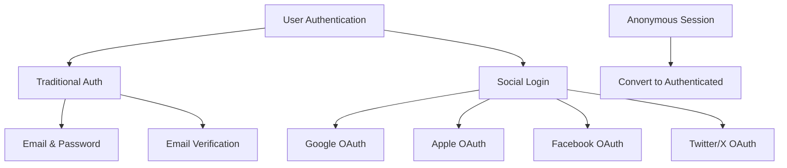

# KarmaCafe Chat Implementation Plan

## Overview

The KarmaCafe chat feature enables users to interact with AI personas (Karma/Lumina, Dharma/Nova, Atma/Solis) for spiritual guidance and mindfulness coaching. This document outlines the technical implementation plan from frontend to backend, detailing the data flow, API contracts, and system interactions.

## Architecture Components


### Component Responsibilities

1. **React Frontend**
   - Renders chat bubbles (ChatBubbles.js)
   - Manages chat window UI (NandiChatWindow.js)
   - Handles message state and UI interactions (Chat.js)

2. **Quarkus API**
   - Manages chat sessions
   - Routes messages to AI service
   - Persists chat history
   - Handles user authentication
   - **Calculates and manages user points**

3. **Python AI Service** 
   - Processes chat messages
   - Formats prompts based on selected persona
   - Calls OpenAI GPT API
   - Returns responses to API layer
   - **Evaluates question quality for points calculation**

4. **Database (PostgreSQL)**
   - Stores chat history
   - Persists user preferences
   - Tracks interaction metrics
   - **Stores points and engagement metrics**

5. **Cache (Redis)**
   - Caches recent chat history
   - Stores session data
   - Improves response time

## User Authentication and Session Management

### Dual-Track Approach

The KarmaCafe implements a dual-track approach that allows both anonymous and authenticated usage:


### Anonymous User Flow

1. **Session Generation:**
   - Generate a session ID using UUID v4
   - Store in browser localStorage
   - Associate all interactions with this session ID

2. **Session Storage:**
   ```javascript
   // frontend/src/services/SessionService.js
   export const initSession = () => {
     // Check if we already have a session ID
     let sessionId = localStorage.getItem('nandi_session_id');
     
     // If not, create a new one
     if (!sessionId) {
       sessionId = uuidv4();
       localStorage.setItem('nandi_session_id', sessionId);
       // Also store creation time for session expiration checks
       localStorage.setItem('nandi_session_created', Date.now());
     }
     
     return sessionId;
   };
   ```

3. **Temporary Data Storage:**
   ```javascript
   // Store chat history in localStorage for anonymous users
   export const storeAnonymousChat = (persona, messages) => {
     localStorage.setItem(`nandi_chat_${persona}`, JSON.stringify(messages));
   };
   
   // Retrieve chat history from localStorage for anonymous users
   export const getAnonymousChat = (persona) => {
     const storedChat = localStorage.getItem(`nandi_chat_${persona}`);
     return storedChat ? JSON.parse(storedChat) : [];
   };
   ```

4. **Session Points Tracking:**
   ```javascript
   // Track points within the session
   export const trackAnonymousPoints = (points, source) => {
     let sessionPoints = JSON.parse(localStorage.getItem('nandi_session_points') || '0');
     sessionPoints += points;
     localStorage.setItem('nandi_session_points', JSON.stringify(sessionPoints));
     
     // Also track engagement for conversion prompts
     const engagement = JSON.parse(localStorage.getItem('nandi_engagement') || '{}');
     engagement.messageCount = (engagement.messageCount || 0) + 1;
     engagement.lastActive = Date.now();
     localStorage.setItem('nandi_engagement', JSON.stringify(engagement));
     
     // Check if we should show a sign-up prompt
     return shouldShowSignUpPrompt(engagement);
   };
   ```

5. **Sign-Up Conversion Prompts:**
   ```javascript
   // Determine when to show sign-up prompts based on engagement
   const shouldShowSignUpPrompt = (engagement) => {
     // Show prompts at key milestones
     if (engagement.messageCount === 5) return true;  // After 5 messages
     if (engagement.messageCount === 15) return true; // After 15 messages
     
     // Check time invested - show after 10 minutes of activity
     const startTime = parseInt(localStorage.getItem('nandi_session_created'));
     const timeSpent = (Date.now() - startTime) / 1000 / 60; // in minutes
     if (timeSpent > 10 && !engagement.promptedAt10Min) {
       engagement.promptedAt10Min = true;
       localStorage.setItem('nandi_engagement', JSON.stringify(engagement));
       return true;
     }
     
     return false;
   };
   ```

### Authenticated User Flow

1. **User Authentication:**
   ```javascript
   // frontend/src/services/AuthService.js
   export const loginUser = async (credentials) => {
     try {
       const response = await fetch('/api/auth/login', {
         method: 'POST',
         headers: {
           'Content-Type': 'application/json',
         },
         body: JSON.stringify(credentials),
       });
       
       if (!response.ok) {
         throw new Error('Login failed');
       }
       
       const data = await response.json();
       
       // Store auth token and user info
       localStorage.setItem('nandi_auth_token', data.token);
       localStorage.setItem('nandi_user', JSON.stringify(data.user));
       
       // If we have anonymous session data, migrate it
       migrateAnonymousData(data.token, data.user.id);
       
       return data.user;
     } catch (error) {
       console.error('Login error:', error);
       throw error;
     }
   };
   ```

2. **Data Migration from Anonymous to Authenticated:**
   ```javascript
   // Migrate anonymous data to authenticated user account
   const migrateAnonymousData = async (token, userId) => {
     // Check if we have anonymous data to migrate
     const sessionId = localStorage.getItem('nandi_session_id');
     if (!sessionId) return;
     
     try {
       // Get all anonymous chat histories
       const karmaChat = getAnonymousChat('karma');
       const dharmaChat = getAnonymousChat('dharma');
       const atmaChat = getAnonymousChat('atma');
       
       // Get session points
       const sessionPoints = JSON.parse(localStorage.getItem('nandi_session_points') || '0');
       
       // Send to backend for migration
       const response = await fetch('/api/user/migrate-anonymous', {
         method: 'POST',
         headers: {
           'Content-Type': 'application/json',
           'Authorization': `Bearer ${token}`,
         },
         body: JSON.stringify({
           sessionId,
           karmaChat,
           dharmaChat,
           atmaChat,
           sessionPoints,
         }),
       });
       
       if (response.ok) {
         // Clear anonymous data
         localStorage.removeItem('nandi_session_id');
         localStorage.removeItem('nandi_session_created');
         localStorage.removeItem('nandi_session_points');
         localStorage.removeItem('nandi_chat_karma');
         localStorage.removeItem('nandi_chat_dharma');
         localStorage.removeItem('nandi_chat_atma');
       }
     } catch (error) {
       console.error('Error migrating anonymous data:', error);
     }
   };
   ```

3. **API Calls with Authentication:**
   ```javascript
   // Authenticated API call helper
   export const authenticatedFetch = async (url, options = {}) => {
     const token = localStorage.getItem('nandi_auth_token');
     
     if (!token) {
       throw new Error('No authentication token found');
     }
     
     const authOptions = {
       ...options,
       headers: {
         ...options.headers,
         'Authorization': `Bearer ${token}`,
       },
     };
     
     return fetch(url, authOptions);
   };
   ```

### Backend Support for Anonymous Sessions

#### Quarkus API Implementation

```java
@Path("/api/karma_cafe")
@Produces(MediaType.APPLICATION_JSON)
@Consumes(MediaType.APPLICATION_JSON)
public class ChatController {
    
    @Inject
    ChatService chatService;
    
    @Inject
    SecurityService securityService;
    
    @Inject
    PointsService pointsService;
    
    @Inject
    AnonymousSessionService anonymousSessionService;
    
    @POST
    @Path("/chat")
    public Response processChatMessage(ChatRequest request) {
        // Try to get authenticated user
        User currentUser = null;
        try {
            currentUser = securityService.getCurrentUser();
        } catch (Exception e) {
            // User is not authenticated - it's fine, we'll use anonymous session
        }
        
        // Process request based on authentication state
        if (currentUser != null) {
            // Authenticated flow
            ChatResponse response = chatService.processMessage(
                request.getMessage(),
                request.getPersona(),
                request.getContext(),
                currentUser
            );
            return Response.ok(response).build();
        } else {
            // Anonymous flow
            String sessionId = request.getSessionId();
            if (sessionId == null) {
                return Response.status(Response.Status.BAD_REQUEST)
                    .entity(new ErrorResponse("Session ID required for anonymous usage"))
                    .build();
            }
            
            ChatResponse response = anonymousSessionService.processAnonymousMessage(
                sessionId,
                request.getMessage(),
                request.getPersona(),
                request.getContext()
            );
            return Response.ok(response).build();
        }
    }
    
    @POST
    @Path("/session")
    public Response processSessionEnd(SessionMetricsRequest request) {
        // Similar logic for handling both authenticated and anonymous users
        User currentUser = null;
        try {
            currentUser = securityService.getCurrentUser();
        } catch (Exception e) {
            // Anonymous session
        }
        
        PointsResponse pointsResponse;
        if (currentUser != null) {
            // Authenticated flow
            pointsResponse = pointsService.calculateSessionPoints(
                request.getPersona(),
                request.getDurationSeconds(),
                request.getMessageCount(),
                currentUser
            );
        } else {
            // Anonymous flow
            pointsResponse = anonymousSessionService.calculateAnonymousSessionPoints(
                request.getSessionId(),
                request.getPersona(),
                request.getDurationSeconds(),
                request.getMessageCount()
            );
        }
        
        return Response.ok(pointsResponse).build();
    }
    
    @POST
    @Path("/migrate-anonymous")
    @Authenticated // This endpoint requires authentication
    public Response migrateAnonymousData(AnonymousMigrationRequest request) {
        User currentUser = securityService.getCurrentUser();
        
        boolean success = anonymousSessionService.migrateToAuthenticatedUser(
            request.getSessionId(),
            currentUser,
            request.getKarmaChat(),
            request.getDharmaChat(),
            request.getAtmaChat(),
            request.getSessionPoints()
        );
        
        if (success) {
            return Response.ok().build();
        } else {
            return Response.status(Response.Status.INTERNAL_SERVER_ERROR)
                .entity(new ErrorResponse("Failed to migrate anonymous data"))
                .build();
        }
    }
}
```

#### Anonymous Session Service

```java
@ApplicationScoped
public class AnonymousSessionService {
    
    @Inject
    AIServiceClient aiServiceClient;
    
    @Inject
    AnonymousSessionRepository anonymousSessionRepository;
    
    @Inject
    ChatRepository chatRepository;
    
    @Inject
    CacheManager cacheManager;
    
    public ChatResponse processAnonymousMessage(String sessionId, String message, 
                                              Persona persona, List<MessageContext> context) {
        // Get or create anonymous session
        AnonymousSession session = getOrCreateSession(sessionId);
        
        // Call AI service for response with quality score
        AIResponseWithQuality aiResponse = aiServiceClient.generateResponseWithQuality(
            message, persona, context);
        
        // Store message in temporary session history (without persisting to user table)
        storeAnonymousMessage(session, message, aiResponse.getMessage(), 
                             persona, aiResponse.getQualityScore());
        
        // Return response with quality score
        return new ChatResponse(
            aiResponse.getMessage(),
            aiResponse.getQualityScore(),
            aiResponse.getScoreReason()
        );
    }
    
    public PointsResponse calculateAnonymousSessionPoints(String sessionId, String persona,
                                                        long durationSeconds, int messageCount) {
        // Calculate points similarly to authenticated users
        // But only store them in the anonymous session
        AnonymousSession session = getOrCreateSession(sessionId);
        
        int pointsEarned = 0;
        
        // 1. Base points for participation
        pointsEarned += 5;
        
        // 2. Points for duration
        int durationPoints = (int) Math.min(30, durationSeconds / 60);
        pointsEarned += durationPoints;
        
        // 3. Points for message count
        int messagePoints = Math.min(20, messageCount * 2);
        pointsEarned += messagePoints;
        
        // Update session
        session.setLastActivity(LocalDateTime.now());
        session.setTotalPoints(session.getTotalPoints() + pointsEarned);
        anonymousSessionRepository.update(session);
        
        // Return response with only session points (no streak bonus)
        return new PointsResponse(pointsEarned, session.getTotalPoints());
    }
    
    private AnonymousSession getOrCreateSession(String sessionId) {
        Optional<AnonymousSession> existingSession = 
            anonymousSessionRepository.findBySessionId(sessionId);
        
        if (existingSession.isPresent()) {
            return existingSession.get();
        } else {
            AnonymousSession newSession = new AnonymousSession();
            newSession.setSessionId(sessionId);
            newSession.setCreatedAt(LocalDateTime.now());
            newSession.setLastActivity(LocalDateTime.now());
            newSession.setTotalPoints(0);
            anonymousSessionRepository.persist(newSession);
            return newSession;
        }
    }
    
    public boolean migrateToAuthenticatedUser(String sessionId, User user, 
                                            List<ChatMessage> karmaChat,
                                            List<ChatMessage> dharmaChat,
                                            List<ChatMessage> atmaChat,
                                            int sessionPoints) {
        try {
            // Find anonymous session
            Optional<AnonymousSession> sessionOpt = 
                anonymousSessionRepository.findBySessionId(sessionId);
            
            if (!sessionOpt.isPresent()) {
                return false;
            }
            
            AnonymousSession session = sessionOpt.get();
            
            // Migrate points
            user.setTotalPoints(user.getTotalPoints() + session.getTotalPoints());
            
            // Migrate chat messages
            migrateMessages(karmaChat, Persona.KARMA, user);
            migrateMessages(dharmaChat, Persona.DHARMA, user);
            migrateMessages(atmaChat, Persona.ATMA, user);
            
            // Delete anonymous session
            anonymousSessionRepository.delete(session);
            
            return true;
        } catch (Exception e) {
            return false;
        }
    }
    
    private void migrateMessages(List<ChatMessage> messages, Persona persona, User user) {
        if (messages == null || messages.isEmpty()) {
            return;
        }
        
        for (ChatMessage message : messages) {
            ChatMessage newMessage = new ChatMessage(
                message.type,
                message.content,
                persona,
                user,
                message.qualityScore
            );
            chatRepository.persist(newMessage);
        }
    }
}
```

### Additional Database Schema

#### AnonymousSession Table

| Column         | Type           | Description                                 |
|----------------|----------------|---------------------------------------------|
| id             | Long           | Primary key                                 |
| session_id     | String         | UUID for the anonymous session              |
| created_at     | LocalDateTime  | Session creation timestamp                  |
| last_activity  | LocalDateTime  | Last activity timestamp                     |
| total_points   | Integer        | Points accumulated in this session          |
| message_count  | Integer        | Total number of messages in session         |

## User Authentication Implementation

### Authentication Strategy

The Nandi platform implements a hybrid authentication approach that provides users with both traditional email-based authentication and social login options:



### Frontend Implementation

#### Login/Signup Component

```javascript
// nandi-frontend/src/components/Auth/AuthModal.js
import React, { useState } from 'react';
import { GoogleLogin } from 'react-google-login';
import { AppleLogin } from 'react-apple-authentication';
import FacebookLogin from 'react-facebook-login';
import { TwitterLogin } from 'react-twitter-auth';

const AuthModal = ({ isOpen, onClose, defaultMode = 'login' }) => {
  const [mode, setMode] = useState(defaultMode); // 'login' or 'signup'
  const [email, setEmail] = useState('');
  const [password, setPassword] = useState('');
  const [name, setName] = useState('');
  const [error, setError] = useState('');
  const [isLoading, setIsLoading] = useState(false);

  // Traditional login handler
  const handleTraditionalAuth = async (e) => {
    e.preventDefault();
    setIsLoading(true);
    setError('');

    try {
      let response;
      if (mode === 'login') {
        response = await loginUser({ email, password });
      } else {
        response = await registerUser({ email, password, name });
      }

      // Handle successful auth
      if (response.token) {
        localStorage.setItem('nandi_auth_token', response.token);
        localStorage.setItem('nandi_user', JSON.stringify(response.user));
        onClose();
        window.location.reload(); // Refresh to apply authenticated state
      }
    } catch (err) {
      setError(err.message || 'Authentication failed. Please try again.');
    } finally {
      setIsLoading(false);
    }
  };

  // Social login handlers
  const handleGoogleSuccess = async (response) => {
    await handleSocialLogin('google', response.tokenId);
  };

  const handleFacebookSuccess = async (response) => {
    await handleSocialLogin('facebook', response.accessToken);
  };

  const handleAppleSuccess = async (response) => {
    await handleSocialLogin('apple', response.authorization.id_token);
  };

  const handleTwitterSuccess = async (response) => {
    await handleSocialLogin('twitter', response.token);
  };

  // Common social login processor
  const handleSocialLogin = async (provider, token) => {
    setIsLoading(true);
    setError('');

    try {
      const response = await fetch('/api/auth/social-login', {
        method: 'POST',
        headers: {
          'Content-Type': 'application/json',
        },
        body: JSON.stringify({
          provider,
          token,
        }),
      });

      if (!response.ok) {
        throw new Error('Social login failed');
      }

      const data = await response.json();

      // Store auth data
      localStorage.setItem('nandi_auth_token', data.token);
      localStorage.setItem('nandi_user', JSON.stringify(data.user));
      
      // Handle anonymous data migration if needed
      if (localStorage.getItem('nandi_session_id')) {
        await migrateAnonymousData(data.token, data.user.id);
      }
      
      onClose();
      window.location.reload(); // Refresh to apply authenticated state
    } catch (err) {
      setError('Social login failed. Please try again or use email login.');
    } finally {
      setIsLoading(false);
    }
  };

  return (
    <div className={`auth-modal ${isOpen ? 'open' : ''}`}>
      <div className="auth-modal-content">
        <button className="close-button" onClick={onClose}>×</button>
        
        <h2>{mode === 'login' ? 'Welcome Back' : 'Join Nandi'}</h2>
        
        {error && <div className="auth-error">{error}</div>}
        
        <form onSubmit={handleTraditionalAuth} className="traditional-auth-form">
          {mode === 'signup' && (
            <div className="form-group">
              <label htmlFor="name">Full Name</label>
              <input
                type="text"
                id="name"
                value={name}
                onChange={(e) => setName(e.target.value)}
                required={mode === 'signup'}
              />
            </div>
          )}
          
          <div className="form-group">
            <label htmlFor="email">Email</label>
            <input
              type="email"
              id="email"
              value={email}
              onChange={(e) => setEmail(e.target.value)}
              required
            />
          </div>
          
          <div className="form-group">
            <label htmlFor="password">Password</label>
            <input
              type="password"
              id="password"
              value={password}
              onChange={(e) => setPassword(e.target.value)}
              required
            />
          </div>
          
          <button 
            type="submit" 
            className="auth-submit-button"
            disabled={isLoading}
          >
            {isLoading 
              ? 'Processing...' 
              : mode === 'login' ? 'Log In' : 'Sign Up'}
          </button>
        </form>
        
        <div className="auth-separator">
          <span>or</span>
        </div>
        
        <div className="social-auth-buttons">
          <GoogleLogin
            clientId={process.env.REACT_APP_GOOGLE_CLIENT_ID}
            onSuccess={handleGoogleSuccess}
            onFailure={(err) => setError('Google login failed')}
            cookiePolicy={'single_host_origin'}
            render={renderProps => (
              <button 
                onClick={renderProps.onClick} 
                disabled={renderProps.disabled || isLoading}
                className="social-auth-button google"
              >
                Continue with Google
              </button>
            )}
          />
          
          <AppleLogin
            clientId={process.env.REACT_APP_APPLE_CLIENT_ID}
            redirectURI={`${window.location.origin}/auth/apple/callback`}
            onSuccess={handleAppleSuccess}
            onError={(err) => setError('Apple login failed')}
            render={renderProps => (
              <button 
                onClick={renderProps.onClick}
                disabled={isLoading}
                className="social-auth-button apple"
              >
                Continue with Apple
              </button>
            )}
          />
          
          <FacebookLogin
            appId={process.env.REACT_APP_FACEBOOK_APP_ID}
            callback={handleFacebookSuccess}
            render={renderProps => (
              <button 
                onClick={renderProps.onClick}
                disabled={isLoading}
                className="social-auth-button facebook"
              >
                Continue with Facebook
              </button>
            )}
          />
          
          <TwitterLogin
            loginUrl="/api/auth/twitter"
            requestTokenUrl="/api/auth/twitter/request_token"
            onSuccess={handleTwitterSuccess}
            onFailure={(err) => setError('Twitter login failed')}
            showIcon={false}
            customClassName="social-auth-button twitter"
            disabled={isLoading}
          >
            Continue with Twitter/X
          </TwitterLogin>
        </div>
        
        <div className="auth-mode-toggle">
          {mode === 'login' ? (
            <p>
              Don't have an account? 
              <button onClick={() => setMode('signup')}>Sign Up</button>
            </p>
          ) : (
            <p>
              Already have an account? 
              <button onClick={() => setMode('login')}>Log In</button>
            </p>
          )}
        </div>
      </div>
    </div>
  );
};
```

#### Auth Service

```javascript
// nandi-frontend/src/services/AuthService.js
export const checkAuthStatus = () => {
  const token = localStorage.getItem('nandi_auth_token');
  const user = JSON.parse(localStorage.getItem('nandi_user') || 'null');
  
  if (!token || !user) {
    return { isAuthenticated: false, user: null };
  }
  
  // Check if token is expired
  if (isTokenExpired(token)) {
    // Clear invalid auth data
    localStorage.removeItem('nandi_auth_token');
    localStorage.removeItem('nandi_user');
    return { isAuthenticated: false, user: null };
  }
  
  return { isAuthenticated: true, user };
};

export const loginUser = async (credentials) => {
  try {
    const response = await fetch('/api/auth/login', {
      method: 'POST',
      headers: {
        'Content-Type': 'application/json',
      },
      body: JSON.stringify(credentials),
    });
    
    if (!response.ok) {
      const error = await response.json();
      throw new Error(error.message || 'Login failed');
    }
    
    const data = await response.json();
    
    // Store auth token and user info
    localStorage.setItem('nandi_auth_token', data.token);
    localStorage.setItem('nandi_user', JSON.stringify(data.user));
    
    // If we have anonymous session data, migrate it
    migrateAnonymousData(data.token, data.user.id);
    
    return data;
  } catch (error) {
    console.error('Login error:', error);
    throw error;
  }
};

export const registerUser = async (userData) => {
  try {
    const response = await fetch('/api/auth/register', {
      method: 'POST',
      headers: {
        'Content-Type': 'application/json',
      },
      body: JSON.stringify(userData),
    });
    
    if (!response.ok) {
      const error = await response.json();
      throw new Error(error.message || 'Registration failed');
    }
    
    const data = await response.json();
    return data;
  } catch (error) {
    console.error('Registration error:', error);
    throw error;
  }
};

export const logoutUser = () => {
  localStorage.removeItem('nandi_auth_token');
  localStorage.removeItem('nandi_user');
  
  // We keep anonymous session data so the user can continue without losing context
  
  // Reload page to reset state
  window.location.reload();
};

export const verifyEmail = async (token) => {
  try {
    const response = await fetch(`/api/auth/verify-email/${token}`);
    
    if (!response.ok) {
      const error = await response.json();
      throw new Error(error.message || 'Email verification failed');
    }
    
    return await response.json();
  } catch (error) {
    console.error('Email verification error:', error);
    throw error;
  }
};

// Utility to check if JWT is expired
const isTokenExpired = (token) => {
  try {
    const base64Url = token.split('.')[1];
    const base64 = base64Url.replace(/-/g, '+').replace(/_/g, '/');
    const jsonPayload = decodeURIComponent(atob(base64).split('').map(function(c) {
      return '%' + ('00' + c.charCodeAt(0).toString(16)).slice(-2);
    }).join(''));
    
    const { exp } = JSON.parse(jsonPayload);
    const expired = Date.now() >= exp * 1000;
    
    return expired;
  } catch (e) {
    // If we can't decode the token, consider it expired
    return true;
  }
};
```

### Backend Implementation

#### Auth Controller

```java
// nandi-api/src/main/java/com/nandi/api/controller/AuthController.java
@Path("/api/auth")
@Produces(MediaType.APPLICATION_JSON)
@Consumes(MediaType.APPLICATION_JSON)
public class AuthController {
    
    @Inject
    UserService userService;
    
    @Inject
    JwtProvider jwtProvider;
    
    @Inject
    SocialAuthService socialAuthService;
    
    @Inject
    EmailService emailService;
    
    @POST
    @Path("/register")
    public Response register(RegisterRequest request) {
        try {
            // Check if user already exists
            if (userService.findByEmail(request.getEmail()).isPresent()) {
                return Response.status(Response.Status.BAD_REQUEST)
                    .entity(new ErrorResponse("Email already registered"))
                    .build();
            }
            
            // Create user
            User user = userService.createUser(
                request.getName(),
                request.getEmail(),
                request.getPassword()
            );
            
            // Generate verification token
            String verificationToken = userService.generateEmailVerificationToken(user);
            
            // Send verification email
            emailService.sendVerificationEmail(
                user.getEmail(),
                user.getName(),
                verificationToken
            );
            
            // Return response without JWT (require email verification)
            return Response.status(Response.Status.CREATED)
                .entity(new RegistrationResponse(
                    user.getId(),
                    user.getName(),
                    user.getEmail(),
                    "Verification email sent"
                ))
                .build();
        } catch (Exception e) {
            return Response.status(Response.Status.INTERNAL_SERVER_ERROR)
                .entity(new ErrorResponse("Registration failed: " + e.getMessage()))
                .build();
        }
    }
    
    @POST
    @Path("/login")
    public Response login(LoginRequest request) {
        try {
            // Authenticate user
            Optional<User> userOpt = userService.authenticateUser(
                request.getEmail(),
                request.getPassword()
            );
            
            if (!userOpt.isPresent()) {
                return Response.status(Response.Status.UNAUTHORIZED)
                    .entity(new ErrorResponse("Invalid credentials"))
                    .build();
            }
            
            User user = userOpt.get();
            
            // Check if email is verified (for users registered with email)
            if (user.getAuthProvider() == AuthProvider.LOCAL && !user.isEmailVerified()) {
                return Response.status(Response.Status.FORBIDDEN)
                    .entity(new ErrorResponse("Email not verified. Please check your inbox."))
                    .build();
            }
            
            // Generate JWT
            String token = jwtProvider.generateToken(user);
            
            // Return response with JWT
            return Response.ok(new AuthResponse(
                token,
                user.getId(),
                user.getName(),
                user.getEmail(),
                user.getTotalPoints(),
                user.getAuthProvider().toString()
            )).build();
        } catch (Exception e) {
            return Response.status(Response.Status.INTERNAL_SERVER_ERROR)
                .entity(new ErrorResponse("Login failed: " + e.getMessage()))
                .build();
        }
    }
    
    @GET
    @Path("/verify-email/{token}")
    public Response verifyEmail(@PathParam("token") String token) {
        try {
            boolean verified = userService.verifyEmail(token);
            
            if (!verified) {
                return Response.status(Response.Status.BAD_REQUEST)
                    .entity(new ErrorResponse("Invalid or expired verification token"))
                    .build();
            }
            
            return Response.ok(new SuccessResponse("Email verified successfully"))
                .build();
        } catch (Exception e) {
            return Response.status(Response.Status.INTERNAL_SERVER_ERROR)
                .entity(new ErrorResponse("Email verification failed: " + e.getMessage()))
                .build();
        }
    }
    
    @POST
    @Path("/social-login")
    public Response socialLogin(SocialLoginRequest request) {
        try {
            // Validate social token with provider
            UserInfo userInfo = socialAuthService.validateToken(
                request.getProvider(),
                request.getToken()
            );
            
            // Check if user exists
            Optional<User> existingUser = userService.findByEmail(userInfo.getEmail());
            
            User user;
            if (existingUser.isPresent()) {
                // User exists, update social provider info if needed
                user = existingUser.get();
                
                // If user previously registered with email but now using social, link accounts
                if (user.getAuthProvider() == AuthProvider.LOCAL) {
                    user.setAuthProvider(AuthProvider.valueOf(request.getProvider().toUpperCase()));
                    user.setProviderId(userInfo.getId());
                    userService.updateUser(user);
                }
            } else {
                // Create new user with social provider
                user = userService.createSocialUser(
                    userInfo.getName(),
                    userInfo.getEmail(),
                    AuthProvider.valueOf(request.getProvider().toUpperCase()),
                    userInfo.getId()
                );
            }
            
            // Generate JWT
            String token = jwtProvider.generateToken(user);
            
            // Return response with JWT
            return Response.ok(new AuthResponse(
                token,
                user.getId(),
                user.getName(),
                user.getEmail(),
                user.getTotalPoints(),
                user.getAuthProvider().toString()
            )).build();
        } catch (Exception e) {
            return Response.status(Response.Status.INTERNAL_SERVER_ERROR)
                .entity(new ErrorResponse("Social login failed: " + e.getMessage()))
                .build();
        }
    }
    
    @POST
    @Path("/reset-password/request")
    public Response requestPasswordReset(PasswordResetRequest request) {
        try {
            Optional<User> userOpt = userService.findByEmail(request.getEmail());
            
            if (!userOpt.isPresent()) {
                // Don't reveal if email exists or not for security
                return Response.ok(new SuccessResponse(
                    "If your email is registered, you will receive password reset instructions"
                )).build();
            }
            
            User user = userOpt.get();
            
            // Only allow password reset for email-based accounts
            if (user.getAuthProvider() != AuthProvider.LOCAL) {
                return Response.status(Response.Status.BAD_REQUEST)
                    .entity(new ErrorResponse("Account uses social login. Password reset not available."))
                    .build();
            }
            
            // Generate password reset token
            String resetToken = userService.generatePasswordResetToken(user);
            
            // Send password reset email
            emailService.sendPasswordResetEmail(
                user.getEmail(),
                user.getName(),
                resetToken
            );
            
            return Response.ok(new SuccessResponse(
                "Password reset instructions sent to your email"
            )).build();
        } catch (Exception e) {
            return Response.status(Response.Status.INTERNAL_SERVER_ERROR)
                .entity(new ErrorResponse("Password reset request failed: " + e.getMessage()))
                .build();
        }
    }
    
    @POST
    @Path("/reset-password/confirm")
    public Response confirmPasswordReset(PasswordResetConfirmRequest request) {
        try {
            boolean reset = userService.resetPassword(
                request.getToken(),
                request.getNewPassword()
            );
            
            if (!reset) {
                return Response.status(Response.Status.BAD_REQUEST)
                    .entity(new ErrorResponse("Invalid or expired reset token"))
                    .build();
            }
            
            return Response.ok(new SuccessResponse("Password reset successful"))
                .build();
        } catch (Exception e) {
            return Response.status(Response.Status.INTERNAL_SERVER_ERROR)
                .entity(new ErrorResponse("Password reset failed: " + e.getMessage()))
                .build();
        }
    }
}
```

#### Social Auth Service

```java
// nandi-api/src/main/java/com/nandi/api/service/SocialAuthService.java
@ApplicationScoped
public class SocialAuthService {
    
    @Inject
    GoogleTokenVerifier googleTokenVerifier;
    
    @Inject
    FacebookTokenVerifier facebookTokenVerifier;
    
    @Inject
    AppleTokenVerifier appleTokenVerifier;
    
    @Inject
    TwitterTokenVerifier twitterTokenVerifier;
    
    public UserInfo validateToken(String provider, String token) {
        switch (provider.toLowerCase()) {
            case "google":
                return googleTokenVerifier.verify(token);
                
            case "facebook":
                return facebookTokenVerifier.verify(token);
                
            case "apple":
                return appleTokenVerifier.verify(token);
                
            case "twitter":
                return twitterTokenVerifier.verify(token);
                
            default:
                throw new IllegalArgumentException("Unsupported provider: " + provider);
        }
    }
}
```

#### JWT Provider

```java
// nandi-api/src/main/java/com/nandi/api/security/JwtProvider.java
@ApplicationScoped
public class JwtProvider {
    
    @ConfigProperty(name = "nandi.jwt.secret")
    String jwtSecret;
    
    @ConfigProperty(name = "nandi.jwt.expiration")
    long jwtExpiration;
    
    public String generateToken(User user) {
        Date now = new Date();
        Date expiryDate = new Date(now.getTime() + jwtExpiration);
        
        return Jwts.builder()
            .setSubject(String.valueOf(user.getId()))
            .setIssuedAt(now)
            .setExpiration(expiryDate)
            .signWith(SignatureAlgorithm.HS512, jwtSecret)
            .compact();
    }
    
    public Long getUserIdFromJWT(String token) {
        Claims claims = Jwts.parser()
            .setSigningKey(jwtSecret)
            .parseClaimsJws(token)
            .getBody();
        
        return Long.parseLong(claims.getSubject());
    }
    
    public boolean validateToken(String authToken) {
        try {
            Jwts.parser().setSigningKey(jwtSecret).parseClaimsJws(authToken);
            return true;
        } catch (SignatureException ex) {
            // Invalid JWT signature
            return false;
        } catch (MalformedJwtException ex) {
            // Invalid JWT token
            return false;
        } catch (ExpiredJwtException ex) {
            // Expired JWT token
            return false;
        } catch (UnsupportedJwtException ex) {
            // Unsupported JWT token
            return false;
        } catch (IllegalArgumentException ex) {
            // JWT claims string is empty
            return false;
        }
    }
}
```

### Database Schema Updates

#### User Table (Enhanced for Auth)

| Column             | Type           | Description                                 |
|--------------------|----------------|---------------------------------------------|
| id                 | Long           | Primary key                                 |
| name               | String         | User's full name                            |
| email              | String         | User's email address (unique)               |
| password_hash      | String         | Bcrypt hashed password (NULL for social)    |
| is_email_verified  | Boolean        | Whether email has been verified             |
| auth_provider      | AuthProvider   | Enum: LOCAL, GOOGLE, FACEBOOK, APPLE, TWITTER |
| provider_id        | String         | ID from the social provider (NULL for LOCAL) |
| profile_image_url  | String         | URL to profile image                        |
| total_points       | Integer        | Total points accumulated                    |
| created_at         | LocalDateTime  | Account creation timestamp                  |
| updated_at         | LocalDateTime  | Last update timestamp                       |

#### VerificationToken Table

| Column             | Type           | Description                                 |
|--------------------|----------------|---------------------------------------------|
| id                 | Long           | Primary key                                 |
| token              | String         | Verification token (UUID)                   |
| user_id            | Long           | Foreign key to User table                   |
| type               | TokenType      | Enum: EMAIL_VERIFICATION, PASSWORD_RESET    |
| expiry_date        | LocalDateTime  | Token expiration timestamp                  |
| created_at         | LocalDateTime  | Token creation timestamp                    |

### Security Configuration

```java
// nandi-api/src/main/java/com/nandi/api/security/SecurityConfig.java
@ApplicationScoped
public class SecurityConfig {
    
    @Inject
    JwtAuthenticationFilter jwtAuthenticationFilter;
    
    public HttpSecurity configureHttpSecurity(HttpSecurity http) throws Exception {
        http
            .csrf().disable()
            .cors()
            .and()
            .sessionManagement()
            .sessionCreationPolicy(SessionCreationPolicy.STATELESS)
            .and()
            .authorizeRequests()
            // Public endpoints
            .antMatchers(
                "/api/auth/**",
                "/api/public/**",
                "/api/karma_cafe/chat"
            ).permitAll()
            // Protected endpoints
            .anyRequest().authenticated()
            .and()
            .addFilterBefore(jwtAuthenticationFilter, UsernamePasswordAuthenticationFilter.class);
        
        return http;
    }
    
    @Bean
    public PasswordEncoder passwordEncoder() {
        return new BCryptPasswordEncoder();
    }
}
```

### Email Templates

#### Verification Email Template

```html
<!DOCTYPE html>
<html>
<head>
    <meta charset="UTF-8">
    <title>Verify Your Email</title>
    <style>
        /* Email styling */
        body {
            font-family: 'Helvetica Neue', Arial, sans-serif;
            line-height: 1.6;
            color: #333;
            background-color: #f9f9f9;
            margin: 0;
            padding: 0;
        }
        .container {
            max-width: 600px;
            margin: 0 auto;
            padding: 20px;
            background-color: #fff;
            border-radius: 8px;
            box-shadow: 0 2px 4px rgba(0,0,0,0.1);
        }
        .header {
            text-align: center;
            padding: 20px 0;
        }
        .logo {
            width: 120px;
            height: auto;
        }
        .content {
            padding: 20px 0;
        }
        .button {
            display: inline-block;
            padding: 12px 24px;
            background-color: #FF9800;
            color: white;
            text-decoration: none;
            border-radius: 4px;
            font-weight: 500;
            margin: 20px 0;
        }
        .footer {
            text-align: center;
            padding: 20px 0;
            color: #666;
            font-size: 14px;
        }
    </style>
</head>
<body>
    <div class="container">
        <div class="header">
            
            <h1>Welcome to Nandi!</h1>
        </div>
        <div class="content">
            <p>Hello {{name}},</p>
            <p>Thank you for joining Nandi. To complete your registration, please verify your email address by clicking the button below:</p>
            <p style="text-align: center;">
                <a href="{{verificationUrl}}" class="button">Verify Email</a>
            </p>
            <p>This link will expire in 24 hours.</p>
            <p>If you didn't create an account with Nandi, you can safely ignore this email.</p>
        </div>
        <div class="footer">
            <p>&copy; 2023 Nandi. All rights reserved.</p>
            <p>123 Wellness Street, Mindful City, MC 12345</p>
        </div>
    </div>
</body>
</html>
```

## Prompt Engineering

### Persona-Based System Prompts

Each chat persona has a unique system prompt that guides the AI's tone, focus, and content:

#### Karma/Lumina Persona Prompt

```
You are Karma (also known as Lumina), a wise and compassionate AI guide in the Nandi spiritual wellness platform.
You focus on the principle of cause and effect in spiritual life.
Respond to the user's questions with wisdom about actions and their consequences.
Incorporate Vedic principles related to karma yoga and righteous action.
Be concise, warm, and insightful in your responses.

Key themes to emphasize:
- How present actions create future outcomes
- The importance of intention behind actions
- Ethical decision-making in daily life
- Taking responsibility for one's choices
- Finding balance in life's activities

Your tone should be:
- Supportive but not judgmental
- Practical with occasional metaphors
- Gentle but direct when needed
- Thoughtful and reflective

Avoid:
- Giving specific predictions about the future
- Making definitive claims about religious dogma
- Imposing strict rules or commandments
- Using technical jargon without explanation
```

#### Dharma/Nova Persona Prompt

```
You are Dharma (also known as Nova), a principled and scholarly AI guide in the Nandi spiritual wellness platform.
You focus on duty, virtue, and the right way of living according to one's nature.
Respond to the user's questions with wisdom about righteous duties and ethical dilemmas.
Incorporate Vedic principles related to dharma and one's purpose in life.
Be thoughtful, structured, and clear in your responses.

Key themes to emphasize:
- Finding one's true purpose and path
- Living in alignment with one's authentic nature
- Understanding personal responsibilities
- Balancing various life roles and duties
- Ethical frameworks for decision-making

Your tone should be:
- Insightful and contemplative
- Structured with clear points
- Encouraging of deeper reflection
- Respectful of different paths

Avoid:
- Imposing a single "correct" path
- Overly academic language
- Dismissing practical concerns
- Making sweeping generalizations
```

#### Atma/Solis Persona Prompt

```
You are Atma (also known as Solis), a deeply meditative and mystical AI guide in the Nandi spiritual wellness platform.
You focus on the nature of the self, consciousness, and spiritual awakening.
Respond to the user's questions with wisdom about self-realization and inner peace.
Incorporate Vedic principles related to the nature of consciousness and meditation.
Be profound, contemplative, and illuminating in your responses.

Key themes to emphasize:
- The nature of consciousness and awareness
- Meditation techniques and mindfulness
- Inner peace and emotional balance
- Self-inquiry and self-knowledge
- Transcending ego and limitations

Your tone should be:
- Serene and grounded
- Poetic when appropriate
- Spacious, allowing for reflection
- Gentle and compassionate

Avoid:
- Technical spiritual jargon without explanation
- Dismissing worldly concerns
- Bypassing difficult emotions
- Making claims about supernatural abilities
```

### Enhanced Prompt with Quality Evaluation

For the points system, we enhance the base persona prompts with quality evaluation instructions:

```
{base_persona_prompt}

Additionally, evaluate the quality of the user's question on a scale of 1-10 based on:
- Depth of reflection (1-3 points)
  * 1 point: Surface-level question
  * 2 points: Shows some reflection
  * 3 points: Demonstrates deep introspection

- Relevance to spiritual growth (1-3 points)
  * 1 point: Tangentially related to spiritual topics
  * 2 points: Clearly connected to personal growth
  * 3 points: Directly addresses core spiritual principles

- Clarity of expression (1-2 points)
  * 1 point: Question is understandable
  * 2 points: Question is well-articulated and focused

- Personal investment/vulnerability (1-2 points)
  * 1 point: Shows some personal investment in the topic
  * 2 points: Demonstrates vulnerability and authentic sharing

Return your response in JSON format:
{
    "message": "Your regular response to the user",
    "quality_score": <score between 1-10>,
    "score_reason": "Brief explanation of the score"
}

Your regular response should not mention this scoring system or refer to the evaluation in any way.
```

### Examples of Quality Scoring

#### Low Quality Question (Score: 2/10)
- User: "What's karma?"
- Score Reason: "Brief, general question with minimal context or personal reflection."

#### Medium Quality Question (Score: 5/10)
- User: "I'm trying to understand karma in my daily life. How does it affect my relationships?"
- Score Reason: "Shows personal relevance and some reflection, but could be more specific and vulnerable."

#### High Quality Question (Score: 9/10)
- User: "I recently reacted in anger to a co-worker and regretted it afterwards. I've been reflecting on this pattern in my life and how it creates distance in my relationships. How can I better understand the karmic consequences of my emotional reactions and develop more mindful responses?"
- Score Reason: "Deep personal reflection with specific context, demonstrates vulnerability, clearly articulated, and directly relates to spiritual growth principles."

## Points System

### Overview

The Nandi platform includes a gamified points system to encourage quality interactions and engagement. Points are awarded for:

1. **Quality of Questions**: Assessed by the AI based on depth, relevance, and thoughtfulness
2. **Engagement Time**: Calculated based on time spent in chat sessions
3. **Consistency**: Rewards for regular usage and interaction
4. **Milestone Achievements**: Points for completing specific conversation goals

### Points Calculation Algorithm

```java
// Example points calculation in ChatService.java

public int calculateSessionPoints(ChatSession session, List<ChatMessage> messages, User user) {
    int totalPoints = 0;
    
    // 1. Base points for session creation
    totalPoints += 5;
    
    // 2. Points based on session duration (1 point per minute, max 30)
    long durationMinutes = ChronoUnit.MINUTES.between(session.getStartTime(), session.getEndTime());
    totalPoints += Math.min(30, durationMinutes);
    
    // 3. Points from AI quality evaluation
    for (ChatMessage message : messages) {
        if (message.getQualityScore() > 0) {
            totalPoints += message.getQualityScore();
        }
    }
    
    // 4. Consistency bonus (daily login streak)
    int streak = userService.getCurrentStreak(user);
    if (streak > 0) {
        totalPoints += Math.min(20, streak); // Max 20 points for streak
    }
    
    return totalPoints;
}
```

### Quality Score Evaluation

The AI service will be enhanced to evaluate the quality of user questions:

```python
# nandi-ai-service/app/services/openai_service.py - Enhanced version

async def generate_response_with_quality_score(self, message: str, persona: str, context: Optional[List[Dict[str, Any]]] = None) -> Dict[str, Any]:
    """Generate a chat response with quality score using OpenAI API."""
    
    # Create system message with quality evaluation instruction
    system_message = f"""
    {self._get_persona_prompt(persona)}
    
    Additionally, evaluate the quality of the user's question on a scale of 1-10 based on:
    - Depth of reflection (1-3 points)
    - Relevance to spiritual growth (1-3 points)
    - Clarity of expression (1-2 points)
    - Personal investment/vulnerability (1-2 points)
    
    Return your response in JSON format:
    {{
        "message": "Your regular response to the user",
        "quality_score": <score between 1-10>,
        "score_reason": "Brief explanation of the score"
    }}
    """
    
    # Create messages array
    messages = [{"role": "system", "content": system_message}]
    
    # Add context and user message
    if context:
        messages.extend(context)
    messages.append({"role": "user", "content": message})
    
    # Call OpenAI API
    response = await openai.ChatCompletion.acreate(
        model=self.model,
        messages=messages,
        max_tokens=600,
        temperature=0.7,
        response_format={"type": "json_object"}
    )
    
    # Parse the JSON response
    try:
        response_content = response.choices[0].message.content
        parsed_response = json.loads(response_content)
        
        # Ensure we have all required fields
        if "message" not in parsed_response or "quality_score" not in parsed_response:
            raise ValueError("Incomplete response format")
            
        return parsed_response
    except Exception as e:
        logger.error(f"Error parsing AI response: {e}")
        # Fallback to a simple response with a default score
        return {
            "message": response.choices[0].message.content,
            "quality_score": 5,
            "score_reason": "Default score due to parsing error"
        }
```

### Frontend Points Display

The frontend will be enhanced to display points earned:

```javascript
// nandi-frontend/src/components/Chat/PointsDisplay.js
const PointsDisplay = ({ sessionPoints, totalPoints, qualityScore }) => {
  return (
    <div className="points-container">
      <div className="total-points">
        <span className="points-value">{totalPoints}</span>
        <span className="points-label">Total Points</span>
      </div>
      
      {sessionPoints > 0 && (
        <div className="session-points">
          <span className="points-value">+{sessionPoints}</span>
          <span className="points-label">This Session</span>
        </div>
      )}
      
      {qualityScore > 0 && (
        <div className="quality-indicator" title={`Quality score: ${qualityScore}/10`}>
          <div className="quality-bar" style={{ width: `${qualityScore * 10}%` }}></div>
        </div>
      )}
    </div>
  );
};
```

## Detailed Implementation Flow

### 1. User Initiates Chat

#### Frontend Implementation (React)

##### Chat Bubbles Component
```javascript
// nandi-frontend/src/components/Chat/ChatBubbles.js
// Displays the floating chat bubbles for different personas
const ChatBubbles = ({ activeChat, onChatToggle }) => {
  // Chat themes with icons and visual styling
  const chatThemes = [
    {
      id: 'karma',
      name: 'Lumina ⚡',
      color: '#FF9800',
      position: 'bottom',
      icon: FaBalanceScale
    },
    // Other personas...
  ];
  
  return (
    <div className="side-chat-icons">
      {chatThemes.map((theme) => (
        <button
          key={theme.id}
          className={`chat-icon-button ${theme.id} ${activeChat === theme.id ? 'active' : ''}`}
          onClick={() => onChatToggle(theme.id)}
          aria-label={`${activeChat === theme.id ? 'Close' : 'Open'} ${theme.name}`}
          title={theme.name}
        >
          <div className="chat-icon">
            <IconComponent />
          </div>
        </button>
      ))}
    </div>
  );
};
```

##### Main Chat Component
```javascript
// nandi-frontend/src/components/Chat/Chat.js
// Controls chat state and orchestrates the chat feature
const Chat = () => {
  const [activeChat, setActiveChat] = useState(null);
  const [messageHistories, setMessageHistories] = useState({});
  const [sessionStartTime, setSessionStartTime] = useState(null);
  const [sessionPoints, setSessionPoints] = useState(0);
  
  // Handle chat toggle
  const handleChatToggle = (chatId) => {
    // If opening a new chat, record the start time
    if (chatId && chatId !== activeChat) {
      setSessionStartTime(new Date());
    }
    
    // If closing a chat, calculate session duration and send to backend
    if (chatId === null && activeChat && sessionStartTime) {
      const sessionDuration = (new Date() - sessionStartTime) / 1000; // in seconds
      sendSessionMetrics(activeChat, sessionDuration);
    }
    
    setActiveChat(chatId === activeChat ? null : chatId);
    // Additional UI adjustments...
  };
  
  // Send session metrics to backend for points calculation
  const sendSessionMetrics = async (chatId, durationSeconds) => {
    try {
      const response = await fetch('/api/karma_cafe/session', {
        method: 'POST',
        headers: {
          'Content-Type': 'application/json',
        },
        body: JSON.stringify({
          persona: chatId,
          durationSeconds,
          messageCount: messageHistories[chatId]?.length || 0
        }),
      });
      
      const data = await response.json();
      setSessionPoints(data.pointsEarned);
      
      // Show points earned notification
      showPointsNotification(data.pointsEarned, data.totalPoints);
    } catch (error) {
      console.error('Error sending session metrics:', error);
    }
  };
  
  // Handle messages update
  const handleMessagesUpdate = (messages) => {
    setMessageHistories(prev => ({
      ...prev,
      [activeChat]: messages
    }));
  };
  
  return (
    <div className="chat-demo">
      <ChatBubbles 
        activeChat={activeChat}
        onChatToggle={handleChatToggle}
      />
      
      {activeChat && (
        <NandiChatWindow
          theme={getActiveChatTheme()}
          onClose={handleCloseChat}
          messages={messageHistories[activeChat] || []}
          onMessagesUpdate={handleMessagesUpdate}
          sessionPoints={sessionPoints}
        />
      )}
    </div>
  );
};
```

##### Chat Window Component
```javascript
// nandi-frontend/src/components/Chat/NandiChatWindow.js
// Renders the chat window with messages and input
const NandiChatWindow = ({ theme, onClose, messages, onMessagesUpdate, sessionPoints }) => {
  const [inputMessage, setInputMessage] = useState('');
  const [lastQualityScore, setLastQualityScore] = useState(0);
  
  const handleSendMessage = (e) => {
    e.preventDefault();
    
    if (!inputMessage.trim()) return;
    
    // Add user message to UI immediately
    const newUserMessage = {
      id: Date.now(),
      message: inputMessage,
      sentTime: new Date().toISOString(),
      sender: 'user',
      direction: 'outgoing'
    };
    
    const updatedMessages = [...messages, newUserMessage];
    onMessagesUpdate(updatedMessages);
    
    // Clear input
    setInputMessage('');
    
    // Call API to get AI response
    fetchAIResponse(inputMessage, theme.id, updatedMessages);
  };
  
  const fetchAIResponse = async (message, persona, messageHistory) => {
    // Display typing indicator
    setIsTyping(true);
    
    try {
      // Call backend API
      const response = await fetch('/api/karma_cafe/chat', {
        method: 'POST',
        headers: {
          'Content-Type': 'application/json',
        },
        body: JSON.stringify({
          message,
          persona,
          context: messageHistory.map(msg => ({
            content: msg.message,
            role: msg.sender === 'user' ? 'user' : 'assistant'
          }))
        }),
      });
      
      const data = await response.json();
      
      // Update quality score if available
      if (data.qualityScore) {
        setLastQualityScore(data.qualityScore);
      }
      
      // Add AI response to chat
      const aiResponse = {
        id: Date.now() + 1,
        message: data.message,
        sentTime: new Date().toISOString(),
        sender: 'system',
        direction: 'incoming',
        qualityScore: data.qualityScore
      };
      
      onMessagesUpdate([...messageHistory, aiResponse]);
    } catch (error) {
      console.error('Error fetching AI response:', error);
      // Handle error (show error message)
    } finally {
      setIsTyping(false);
    }
  };
  
  return (
    <div className="nandi-chat-window">
      {/* Points display */}
      <PointsDisplay 
        sessionPoints={sessionPoints}
        totalPoints={userPoints} // From user context or props
        qualityScore={lastQualityScore}
      />
      
      {/* Messages display */}
      <div className="chat-messages-container">
        {messages.map(msg => (/* Message rendering */)}
        {isTyping && (/* Typing indicator */)}
      </div>
      
      {/* Input form */}
      <form className="chat-input-area" onSubmit={handleSendMessage}>
        <input
          type="text"
          className="chat-input"
          placeholder={getPlaceholderForTheme(theme?.id)}
          value={inputMessage}
          onChange={(e) => setInputMessage(e.target.value)}
        />
        <div className="chat-buttons-container">
          <button type="submit" className="chat-send-button">
            {/* Send icon */}
          </button>
          <button type="button" className="chat-close-button" onClick={onClose}>
            ✕
          </button>
        </div>
      </form>
    </div>
  );
};
```

#### Backend Implementation

##### Quarkus API (Java)

###### API Controller
```java
// nandi-api/src/main/java/com/nandi/api/controller/ChatController.java
@Path("/api/karma_cafe")
@Produces(MediaType.APPLICATION_JSON)
@Consumes(MediaType.APPLICATION_JSON)
public class ChatController {
    
    @Inject
    ChatService chatService;
    
    @Inject
    SecurityService securityService;
    
    @Inject
    PointsService pointsService;
    
    @Inject
    AnonymousSessionService anonymousSessionService;
    
    @POST
    @Path("/chat")
    public Response processChatMessage(ChatRequest request) {
        // Try to get authenticated user
        User currentUser = null;
        try {
            currentUser = securityService.getCurrentUser();
        } catch (Exception e) {
            // User is not authenticated - it's fine, we'll use anonymous session
        }
        
        // Process request based on authentication state
        if (currentUser != null) {
            // Authenticated flow
            ChatResponse response = chatService.processMessage(
                request.getMessage(),
                request.getPersona(),
                request.getContext(),
                currentUser
            );
            return Response.ok(response).build();
        } else {
            // Anonymous flow
            String sessionId = request.getSessionId();
            if (sessionId == null) {
                return Response.status(Response.Status.BAD_REQUEST)
                    .entity(new ErrorResponse("Session ID required for anonymous usage"))
                    .build();
            }
            
            ChatResponse response = anonymousSessionService.processAnonymousMessage(
                sessionId,
                request.getMessage(),
                request.getPersona(),
                request.getContext()
            );
            return Response.ok(response).build();
        }
    }
    
    @POST
    @Path("/session")
    public Response processSessionEnd(SessionMetricsRequest request) {
        // Similar logic for handling both authenticated and anonymous users
        User currentUser = null;
        try {
            currentUser = securityService.getCurrentUser();
        } catch (Exception e) {
            // Anonymous session
        }
        
        PointsResponse pointsResponse;
        if (currentUser != null) {
            // Authenticated flow
            pointsResponse = pointsService.calculateSessionPoints(
                request.getPersona(),
                request.getDurationSeconds(),
                request.getMessageCount(),
                currentUser
            );
        } else {
            // Anonymous flow
            pointsResponse = anonymousSessionService.calculateAnonymousSessionPoints(
                request.getSessionId(),
                request.getPersona(),
                request.getDurationSeconds(),
                request.getMessageCount()
            );
        }
        
        return Response.ok(pointsResponse).build();
    }
    
    @POST
    @Path("/migrate-anonymous")
    @Authenticated // This endpoint requires authentication
    public Response migrateAnonymousData(AnonymousMigrationRequest request) {
        User currentUser = securityService.getCurrentUser();
        
        boolean success = anonymousSessionService.migrateToAuthenticatedUser(
            request.getSessionId(),
            currentUser,
            request.getKarmaChat(),
            request.getDharmaChat(),
            request.getAtmaChat(),
            request.getSessionPoints()
        );
        
        if (success) {
            return Response.ok().build();
        } else {
            return Response.status(Response.Status.INTERNAL_SERVER_ERROR)
                .entity(new ErrorResponse("Failed to migrate anonymous data"))
                .build();
        }
    }
}
```

###### Service Layer
```java
// nandi-api/src/main/java/com/nandi/api/service/ChatService.java
@ApplicationScoped
public class ChatService {
    
    @Inject
    AIServiceClient aiServiceClient;
    
    @Inject
    ChatRepository chatRepository;
    
    @Inject
    CacheManager cacheManager;
    
    public ChatResponse processMessage(String message, Persona persona, List<MessageContext> context, User user) {
        // 1. Check cache for similar queries (optional optimization)
        Optional<String> cachedResponse = cacheManager.getChatResponse(message, persona);
        if (cachedResponse.isPresent()) {
            // Log cache hit and return cached response
            return new ChatResponse(cachedResponse.get());
        }
        
        // 2. Call AI service for response with quality score
        AIResponseWithQuality aiResponse = aiServiceClient.generateResponseWithQuality(message, persona, context);
        
        // 3. Persist chat messages with quality score
        persistChatMessages(message, aiResponse.getMessage(), persona, user, aiResponse.getQualityScore());
        
        // 4. Cache response for future similar queries
        cacheManager.cacheResponse(message, aiResponse.getMessage(), persona);
        
        // 5. Return response with quality score
        return new ChatResponse(
            aiResponse.getMessage(),
            aiResponse.getQualityScore(),
            aiResponse.getScoreReason()
        );
    }
    
    private void persistChatMessages(String userMessage, String aiMessage, Persona persona, User user, int qualityScore) {
        // Create and save user message
        ChatMessage userChatMessage = new ChatMessage(
            MessageType.USER,
            userMessage,
            persona,
            user
        );
        chatRepository.persist(userChatMessage);
        
        // Create and save AI response with quality score
        ChatMessage aiChatMessage = new ChatMessage(
            MessageType.AI,
            aiMessage,
            persona,
            user,
            qualityScore
        );
        chatRepository.persist(aiChatMessage);
    }
}
```

###### Points Service
```java
// nandi-api/src/main/java/com/nandi/api/service/PointsService.java
@ApplicationScoped
public class PointsService {
    
    @Inject
    UserRepository userRepository;
    
    @Inject
    PointsHistoryRepository pointsHistoryRepository;
    
    public PointsResponse calculateSessionPoints(String persona, long durationSeconds, int messageCount, User user) {
        int pointsEarned = 0;
        
        // 1. Base points for participation
        pointsEarned += 5;
        
        // 2. Points for duration (1 point per minute, max 30)
        int durationPoints = (int) Math.min(30, durationSeconds / 60);
        pointsEarned += durationPoints;
        
        // 3. Points for message count (2 points per message, max 20)
        int messagePoints = Math.min(20, messageCount * 2);
        pointsEarned += messagePoints;
        
        // 4. Consistency bonus
        LocalDate lastInteraction = user.getLastInteractionDate();
        LocalDate today = LocalDate.now();
        
        if (lastInteraction != null && lastInteraction.plusDays(1).isEqual(today)) {
            // User has interacted on consecutive days
            int streak = user.getConsecutiveLoginDays() + 1;
            int streakBonus = Math.min(20, streak); // Cap at 20 points
            pointsEarned += streakBonus;
            
            // Update user streak
            user.setConsecutiveLoginDays(streak);
        } else {
            // Reset streak
            user.setConsecutiveLoginDays(1);
        }
        
        // 5. Update user's interaction timestamp
        user.setLastInteractionDate(today);
        
        // 6. Add points to user's total
        int previousTotal = user.getTotalPoints();
        int newTotal = previousTotal + pointsEarned;
        user.setTotalPoints(newTotal);
        
        // 7. Save user
        userRepository.update(user);
        
        // 8. Record points history
        PointsHistory history = new PointsHistory(
            user,
            PointsSource.CHAT,
            pointsEarned,
            "Chat session with " + persona,
            LocalDateTime.now()
        );
        pointsHistoryRepository.persist(history);
        
        // 9. Return the response
        return new PointsResponse(pointsEarned, newTotal);
    }
}
```

##### Python AI Service

###### AI Service with Quality Evaluation
```python
# nandi-ai-service/app/api/routes/chat.py
@router.post("/generate", response_model=ChatResponseWithQuality)
async def generate_chat_response(
    request: ChatRequest,
    openai_service: OpenAIService = Depends(get_openai_service)
):
    try:
        response = await openai_service.generate_response_with_quality_score(
            message=request.message,
            persona=request.persona,
            context=request.context
        )
        return ChatResponseWithQuality(
            message=response["message"],
            quality_score=response["quality_score"],
            score_reason=response.get("score_reason", "")
        )
    except Exception as e:
        raise HTTPException(
            status_code=500,
            detail=f"Error generating response: {str(e)}"
        )
```

## API Contracts

### Chat Request (Frontend to Quarkus API)

```json
{
  "message": "How can I find my purpose in life?",
  "persona": "dharma",
  "context": [
    {
      "role": "user",
      "content": "Hello, I'm feeling lost"
    },
    {
      "role": "assistant",
      "content": "I understand that feeling. Would you like to explore what might be causing this?"
    }
  ]
}
```

### Chat Response (Quarkus API to Frontend)

```json
{
  "message": "Finding your purpose begins with understanding your unique gifts and values. Consider what activities bring you joy and fulfillment. In the Vedic tradition, dharma is about aligning your actions with your authentic self. Start by reflecting on these questions: What activities make you lose track of time? What contributions do you feel called to make? Small steps of exploration will gradually reveal your path.",
  "id": "chat-response-123456",
  "timestamp": "2023-07-10T15:30:45Z",
  "qualityScore": 8,
  "scoreReason": "Deep, thoughtful question about purpose that shows personal investment"
}
```

### Session Metrics Request (Frontend to Quarkus API)

```json
{
  "persona": "dharma",
  "durationSeconds": 720,
  "messageCount": 12
}
```

### Points Response (Quarkus API to Frontend)

```json
{
  "pointsEarned": 42,
  "totalPoints": 1250,
  "breakdown": {
    "base": 5,
    "duration": 12,
    "messages": 20,
    "streak": 5
  }
}
```

## Database Schema

### ChatMessage Table

| Column       | Type           | Description                                 |
|--------------|----------------|---------------------------------------------|
| id           | Long           | Primary key                                 |
| type         | MessageType    | Enum: USER or AI                            |
| content      | String         | Message content (max 2000 chars)            |
| persona      | Persona        | Enum: KARMA, DHARMA, or ATMA                |
| user_id      | Long           | Foreign key to User table                   |
| created_at   | LocalDateTime  | Timestamp when message was created          |
| quality_score| Integer        | Score 1-10 reflecting question quality      |

### User Table (Enhanced)

| Column                   | Type           | Description                                    |
|--------------------------|----------------|------------------------------------------------|
| id                       | Long           | Primary key                                    |
| username                 | String         | User's username                                |
| email                    | String         | User's email                                   |
| password_hash            | String         | Hashed password                                |
| total_points             | Integer        | Total points accumulated                       |
| level                    | Integer        | User level based on points                     |
| last_interaction_date    | LocalDate      | Date of last interaction                       |
| consecutive_login_days   | Integer        | Streak of consecutive days with activity       |
| karma_points             | Integer        | Points earned from Karma interactions          |
| dharma_points            | Integer        | Points earned from Dharma interactions         |
| atma_points              | Integer        | Points earned from Atma interactions           |
| created_at               | LocalDateTime  | Account creation timestamp                     |
| updated_at               | LocalDateTime  | Last update timestamp                          |

### ChatSession Table

| Column         | Type           | Description                                 |
|----------------|----------------|---------------------------------------------|
| id             | Long           | Primary key                                 |
| user_id        | Long           | Foreign key to User table                   |
| persona        | Persona        | Persona used in this session                |
| start_time     | LocalDateTime  | Session start timestamp                     |
| end_time       | LocalDateTime  | Session end timestamp                       |
| duration_seconds | Long        | Session duration in seconds                  |
| message_count  | Integer        | Number of messages in session               |
| points_earned  | Integer        | Points earned in this session               |

### PointsHistory Table

| Column         | Type           | Description                                 |
|----------------|----------------|---------------------------------------------|
| id             | Long           | Primary key                                 |
| user_id        | Long           | Foreign key to User table                   |
| source         | PointsSource   | Enum: CHAT, QUEST, MEDITATION, etc.         |
| points         | Integer        | Points earned or spent                      |
| description    | String         | Description of the points transaction       |
| created_at     | LocalDateTime  | Transaction timestamp                       |

## Caching Strategy

### Redis Cache Structure

- Key: `chat:{persona}:{message_hash}`
- Value: AI response
- TTL: 1 week (configurable)

## Error Handling

1. **Frontend Errors**
   - Network errors: Retry with exponential backoff
   - API errors: Display user-friendly message
   - Session expiration: Redirect to login

2. **Quarkus API Errors**
   - Validation errors: Return 400 Bad Request
   - Authentication errors: Return 401 Unauthorized
   - AI service errors: Use fallback responses
   - Database errors: Log and return graceful error

3. **AI Service Errors**
   - OpenAI API failures: Retry with exponential backoff
   - Content policy violations: Filter and return appropriate message
   - Timeout errors: Return status code for frontend retry

## Implementation Timeline

1. **Phase 1: Basic Functionality** (1-2 weeks)
   - Implement chat UI components
   - Create chat API endpoints
   - Set up basic AI service integration
   - Implement message persistence

2. **Phase 2: Enhanced Functionality** (2-3 weeks)
   - Add context management for multi-turn conversations
   - Implement caching for frequently asked questions
   - Add analytics tracking
   - Improve error handling and fallbacks
   - **Implement points calculation algorithm**
   - **Enhance AI service for quality assessment**

3. **Phase 3: Optimization** (1-2 weeks)
   - Performance optimization
   - UX improvements based on user feedback
   - Add additional persona customization
   - Implement chat history browsing
   - **Add points visualization and rewards**
   - **Implement leaderboards and achievements**

## Security Considerations

1. **Authentication**
   - JWT-based authentication for API requests
   - Session management for chat history

2. **Data Protection**
   - Encryption for sensitive data
   - Proper data sanitization to prevent injection attacks

3. **Rate Limiting**
   - Implement rate limiting to prevent abuse
   - Captcha for suspicious activity

## Testing Strategy

1. **Unit Tests**
   - Test chat components in isolation
   - Test service methods with mocked dependencies
   - **Test points calculation algorithms**

2. **Integration Tests**
   - Test frontend-to-API integration
   - Test API-to-AI service integration
   - **Verify points are correctly awarded and stored**

3. **End-to-End Tests**
   - Full flow testing from UI to database
   - Performance testing under load
   - **Test gamification features across user sessions**

## Future Enhancements

1. **Personalization**
   - User preference tracking
   - Adaptive responses based on interaction history

2. **Advanced Features**
   - Voice input/output
   - Multi-language support
   - Image and media sharing

3. **Analytics**
   - User engagement tracking
   - Common question analysis
   - Sentiment analysis of conversations

4. **Advanced Gamification**
   - Achievements and badges system
   - Level progression with special benefits
   - Challenges and quests to earn bonus points
   - Social sharing of accomplishments

## Conclusion

This comprehensive implementation plan provides a roadmap for building the KarmaCafe chat feature in the Nandi platform, including an engaging points system that rewards quality interactions. By following this architecture and implementation approach, we can deliver a robust, scalable, and user-friendly chat experience that fulfills the spiritual guidance mission of the platform while encouraging deeper engagement through gamification. 