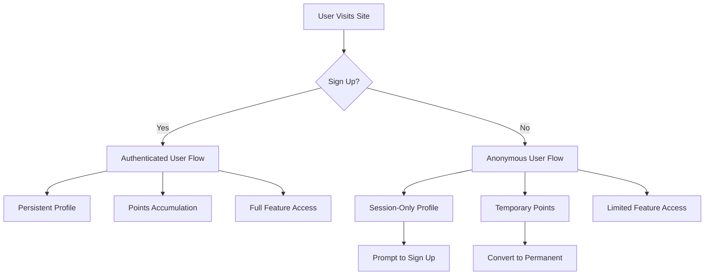

# User Management Strategy for Nandi Platform

## Overview

This document outlines the user management strategy for the Nandi platform, focusing on a dual-track approach that allows both anonymous and registered users to engage with the platform while encouraging eventual registration.

## Dual-Track Approach

The Nandi platform implements a dual-track approach for user management:



### Anonymous Users

- Visitors can explore the platform without signing up
- Anonymous sessions will be tracked with temporary IDs stored in localStorage
- Limited feature access (e.g., basic chat, introductory meditations)
- Chat history is saved only for the current browser session
- Points earned are temporary and shown with prompts to sign up to save progress
- Anonymous users receive occasional gentle prompts to create an account

### Registered Users

- Full access to all platform features
- Persistent chat history across devices
- Complete points system with history and achievements
- Personalized recommendations based on interaction history
- Progress tracking across all spiritual practices

## Technical Implementation

### Frontend Storage for Anonymous Users

```typescript
// Anonymous user management
const initAnonymousSession = () => {
  // Check if anonymous session exists
  let anonymousId = localStorage.getItem('nandi_anonymous_id');
  
  if (!anonymousId) {
    // Create new anonymous ID
    anonymousId = `anon_${Date.now()}_${Math.random().toString(36).substr(2, 9)}`;
    localStorage.setItem('nandi_anonymous_id', anonymousId);
    
    // Initialize empty session data
    localStorage.setItem('nandi_chat_history', JSON.stringify([]));
    localStorage.setItem('nandi_temp_points', '0');
  }
  
  return anonymousId;
};

// Check if user is logged in or use anonymous session
const getUserId = () => {
  const loggedInUserId = localStorage.getItem('nandi_user_id');
  
  if (loggedInUserId) {
    return {
      userId: loggedInUserId,
      isAnonymous: false
    };
  }
  
  return {
    userId: initAnonymousSession(),
    isAnonymous: true
  };
};
```

### API Layer Support

```java
@Entity
@Table(name = "anonymous_sessions")
public class AnonymousSession {
    @Id
    private String sessionId;
    
    private LocalDateTime createdAt;
    private LocalDateTime lastActiveAt;
    private int temporaryPoints;
    
    @OneToMany(mappedBy = "session", cascade = CascadeType.ALL)
    private List<ChatMessage> messages;
    
    // Constructors, getters, setters
}

// Anonymous session controller
@RestController
@RequestMapping("/api/anonymous")
public class AnonymousSessionController {
    
    @PostMapping("/chat")
    public ResponseEntity<ChatResponse> handleAnonymousChat(
            @RequestBody ChatRequest request) {
        // Process chat message from anonymous user
        // Calculate points but flag as temporary
        // Return appropriate response with conversion prompt
    }
    
    @PostMapping("/convert")
    public ResponseEntity<UserResponse> convertToRegisteredUser(
            @RequestBody UserRegistrationRequest request) {
        // Convert anonymous session to registered user
        // Transfer chat history and points
        // Return new user credentials
    }
}
```

### Session-to-User Conversion

When an anonymous user decides to register, we'll implement a seamless conversion process:

```javascript
// Frontend conversion flow
const convertToRegisteredUser = async (email, password, username) => {
  const anonymousId = localStorage.getItem('nandi_anonymous_id');
  
  if (!anonymousId) {
    // Standard registration without conversion
    return registerNewUser(email, password, username);
  }
  
  // Get temporary data to be migrated
  const chatHistory = JSON.parse(localStorage.getItem('nandi_chat_history') || '[]');
  const temporaryPoints = parseInt(localStorage.getItem('nandi_temp_points') || '0');
  
  // Convert the anonymous session to a registered user
  const response = await fetch('/api/anonymous/convert', {
    method: 'POST',
    headers: {
      'Content-Type': 'application/json'
    },
    body: JSON.stringify({
      anonymousId,
      email,
      password,
      username,
      chatHistory,
      temporaryPoints
    })
  });
  
  const userData = await response.json();
  
  // Clean up anonymous session data
  localStorage.removeItem('nandi_anonymous_id');
  localStorage.removeItem('nandi_chat_history');
  localStorage.removeItem('nandi_temp_points');
  
  // Set registered user data
  localStorage.setItem('nandi_user_id', userData.id);
  localStorage.setItem('nandi_auth_token', userData.token);
  
  return userData;
};
```

## Anonymous User Experience

Anonymous users will have a streamlined experience with strategic prompts to encourage registration:

1. **First Visit**
   - Welcome message explaining the benefits of creating an account
   - Option to "Try Now" or "Sign Up"
   - No barriers to immediate exploration

2. **Engagement Prompts**
   - After earning first points: "Create an account to save your progress!"
   - After 5 messages in chat: "Sign up to continue this conversation later"
   - After 10 minutes of activity: "You're enjoying Nandi! Create an account for the full experience"

3. **Feature Limitations**
   - Limited chat history (most recent session only)
   - Basic personas available, special personas for registered users
   - Temporary points system with conversion incentives

## Benefits of Dual-Track Approach

1. **Lower Entry Barrier**
   - Users can try before committing, reducing friction
   - Immediate value without registration process

2. **Data-Driven Conversion**
   - Strategic prompts based on engagement metrics
   - Demonstrate value before asking for registration

3. **Seamless Transition**
   - No loss of progress when converting to registered user
   - Preserves user investment and continuity

4. **Privacy Respect**
   - Clear separation of anonymous vs. authenticated data
   - Transparency about data retention policies

## Implementation Timeline

1. **Phase 1: Basic Anonymous Support**
   - Implement localStorage session tracking
   - Create temporary chat history storage
   - Develop basic conversion UI prompts

2. **Phase 2: Backend Anonymous Support**
   - Create AnonymousSession entity and API endpoints
   - Implement conversion flow in backend
   - Add points tracking for anonymous users

3. **Phase 3: Enhanced Conversion**
   - Add analytics to measure conversion rates
   - Optimize prompt timing and messaging
   - Implement A/B testing for conversion strategies

## Conclusion

The dual-track approach offers the best of both worlds: immediate access for curious users and enhanced features for committed users. By implementing thoughtful conversion strategies and seamless migration of user data, we can maximize both user satisfaction and registration rates.

This approach aligns with Nandi's core philosophy of meeting users where they are while gently guiding them toward deeper engagement with spiritual practices. 